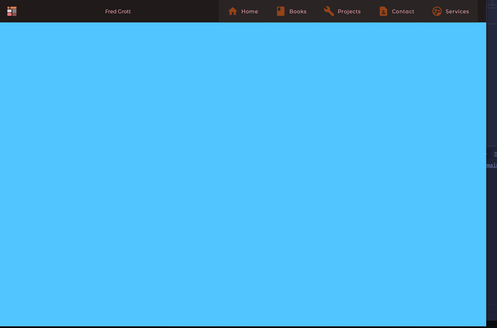
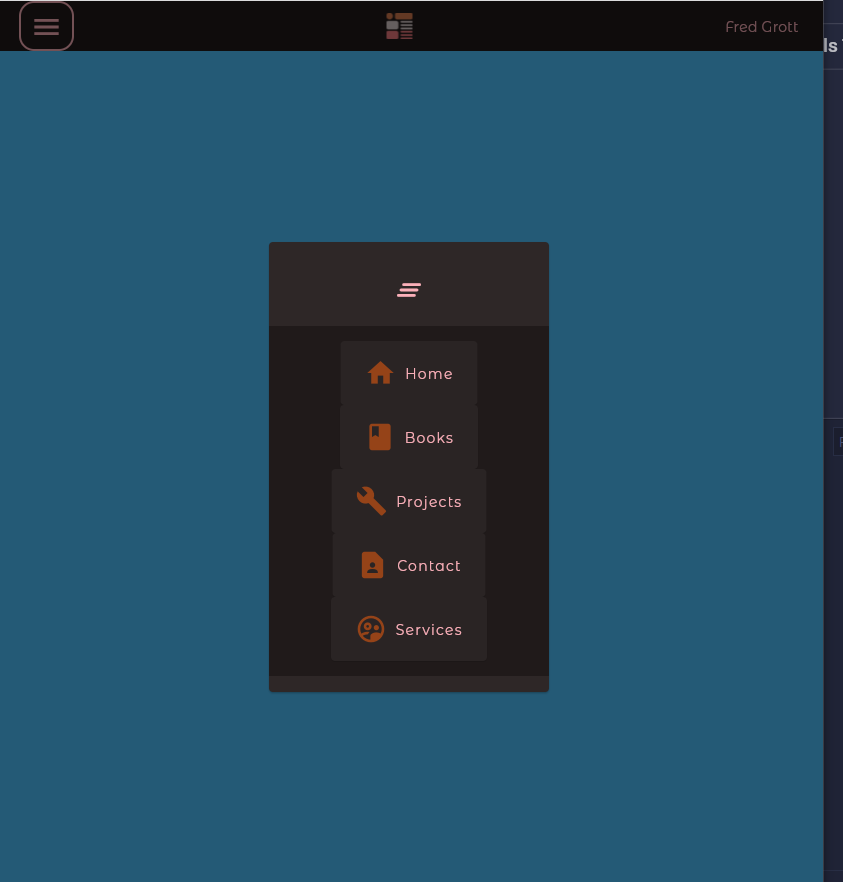

# web_navbar

Part of my code building for the flutter book called Flutter On Web.

## ScreenShots

Desktop:

Mobile:

## Medium Article And Book

The medium article details how to create a WebBar as part of the different Web UX one has to implement in Flutter to create websites:

[Medium Article, via the free friend link]()

Book stuff is at my GitHub IO website:

[My GitHub IO Website](https://fredgrott.github.io)

## Contact

I tend to use KeyBase as my main conferencing and contact hub, my KeyBase profile url:

[Fred Grott's KeyBase Profile](https://keybase.io/fredgrott)

